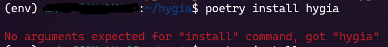

## Installation Guide for Contributors

### Recommendation
We recommend Ubuntu 22.04 (or WSL2 with Ubuntu 22.04 on Windows 11 machines), Python 3.9 and Jupyter Notebook. It is also recommended to have Jupyter and Python extensions in your favorite code editor.

### Requirements
#### Python 3.9
- python3.9-dev
- python3.9-venv

#### Pytest
```
pip install pytest
```

#### Poetry
```
pip install poetry
```

### Running
First you need to have env in your virtual machine, as mentioned above, and then clone the repository. You can also check the documentation [available here](https://virtualenv.pypa.io/en/latest/installation.html).

Then create a venv and install the requirements with the following commands:
```
python3.9 -m venv env
source env/bin/activate
pip install -r requirements-dev.txt
```

The next step is to install Hygia itself. You will need poetry to do it:
```
poetry install hygia
```

You may now open the code. Access examples/yaml_example.ipynb and click on Execute Cell as shown in the image bellow (using Visual Studio Code).


This step will ask you to choose a kernel. We recommend using the Python3.9 kernel (this may need some recommended extensions for Jupyter and Python).

You may need to fix some issues before it runs completely. Feel free to create a copy of config/default_config.yaml and change it as needed. Also, reporting errors really help to enhance this code, please let us know what problems you faced!

### Testing
To run and verify the tests run:
```
pytest --cov
```

### Common problems
Some problems may occur due to the low percentage of test coverage or errors in the code itself. In these cases, don't worry. Soon the problems will be solved.

Don't forget to send a message or create new issues if you find any unexpected situation.

#### 1.0 - Execution errors
The problem shown below is caused by unexpected parameters in config/default_config.yaml. We are currently working to solve this problem, as well as others related to this step.


#### 2.0 - No arguments expected for "install" command
This is a simple error that may occur depending on the poetry version you are using. If you are facing it, just type "poetry install" instead of "poetry install hygia".



#### 3.0 - Couldn't install requirements-dev.txt
This is another simple error. It occurs when you forget the "-r" in the command presented in the Running section. Just write as shown below:

```
pip install -r requirements-dev.txt
```

If you still can't install the requirements, let us know exactly what you're facing by opening an issue.